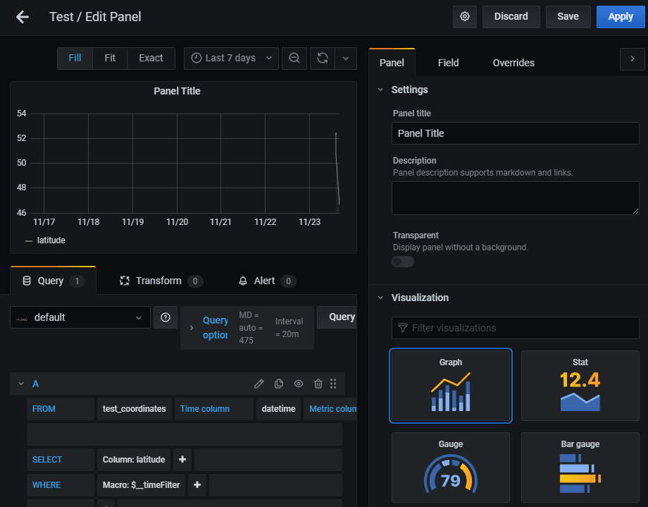

# Mapbox Panel plugin

## Introduction

Let's consider a time-series with geospatial data, for example:

| datetime            | latitude | longitude |
|---------------------|----------|-----------|
| 2020-11-23 13:27:02 | 52.375   | 4.89865   |
| 2020-11-23 13:27:02 | 52.3725  | 4.90977   |
| 2020-11-23 13:27:02 | 52.3193  | 5.13439   |
| 2020-11-23 13:27:02 | 52.4427  | 5.54845   |
| 2020-11-23 13:27:02 | 50.7302  | 2.4198    |
| 2020-11-23 15:12:49 | 47.0571  | 15.4308   |
| 2020-11-23 15:12:49 | 47.1479  | 15.7725   |
| 2020-11-23 15:12:49 | 46.7176  | 15.6473   |
| 2020-11-23 15:12:49 | 47.2397  | 18.8275   |

Querying this data from Grafana together with this plugin will allow you to dynamically display parts of this data on a Mapbox map:



## Future ideas

- Custom styling.
- Mapbox Studio API key + style integration.

## Development
1. Install dependencies
```BASH
yarn install
```
2. Build plugin in development mode or run in watch mode
```BASH
yarn dev
```
or
```BASH
yarn watch
```
3. Build plugin in production mode
```BASH
yarn build
```

## Learn more
- [Build a panel plugin tutorial](https://grafana.com/tutorials/build-a-panel-plugin)
- [Grafana documentation](https://grafana.com/docs/)
- [Grafana Tutorials](https://grafana.com/tutorials/) - Grafana Tutorials are step-by-step guides that help you make the most of Grafana
- [Grafana UI Library](https://developers.grafana.com/ui) - UI components to help you build interfaces using Grafana Design System
